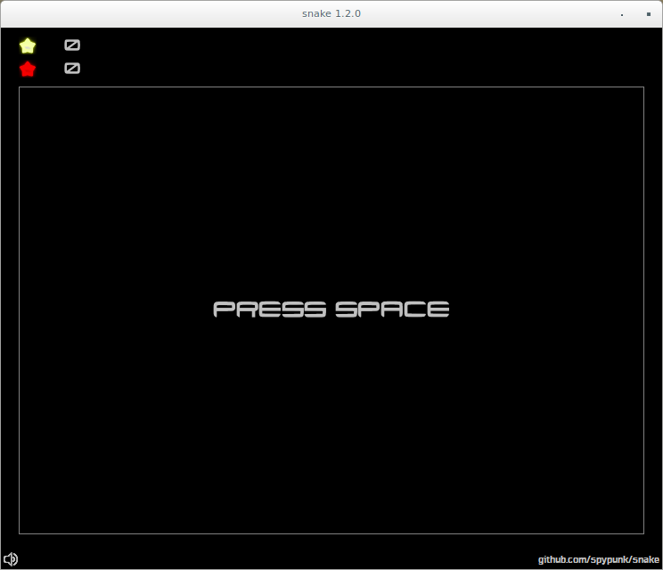
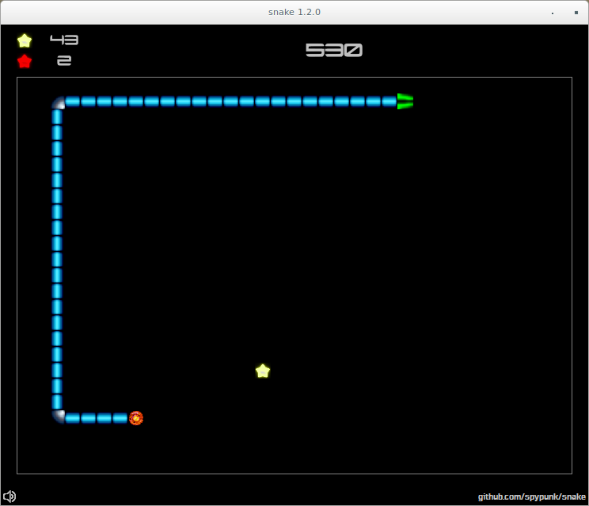
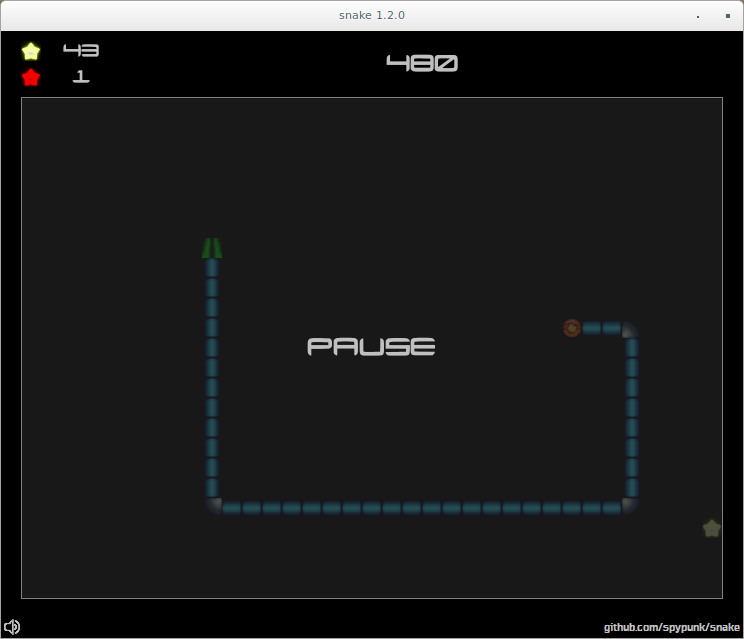
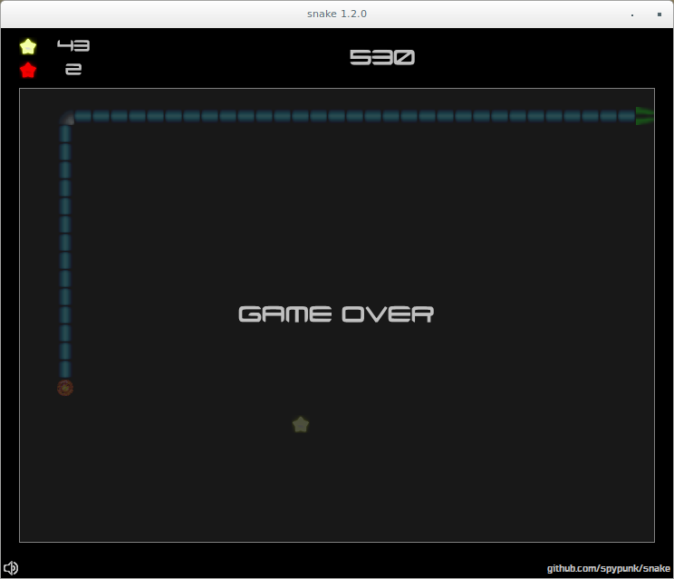

# snake - Just another Snake clone 

    

## How it looks ?

## How to build it ?

You will need a Java JDK 8+ and maven 3+.

Execute **mvn clean package assembly:single** to build the release package.

## How to play ?

- SPACE - Start a new game

- UP - Change snake direction to the north

- DOWN - Change snake direction to the south

- LEFT - Change snake direction to the west

- RIGHT - Change snake direction to the east

- P - Pause the current game

- M - Mute sound

- PAGE UP - Increase the volume

- PAGE DOWN - Decrease the volume

.......................................................
Having a supportive team can make a big difference in your life and work. They can help you accomplish your goals, overcome challenges, and provide a sense of community and belonging. It's important to appreciate and recognize their contributions, and to make sure you show your gratitude for their support....................
